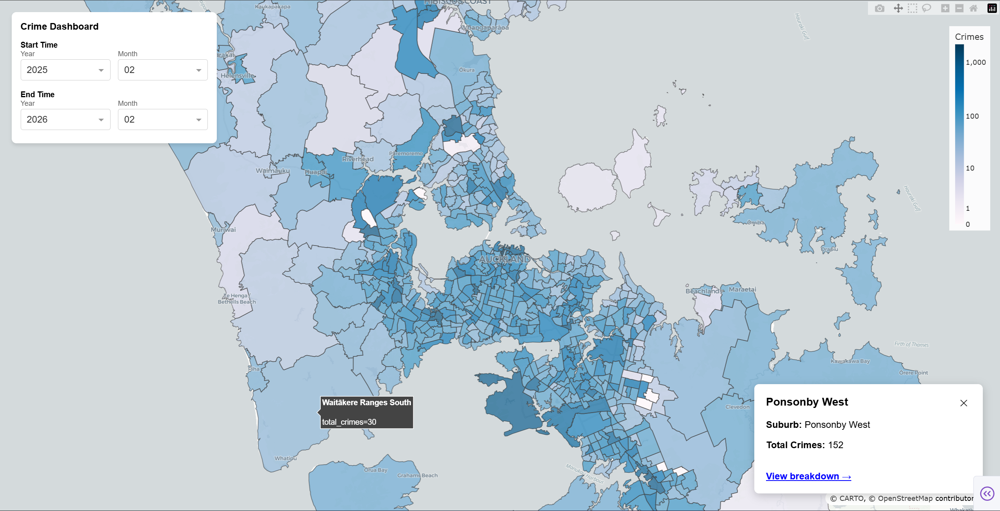
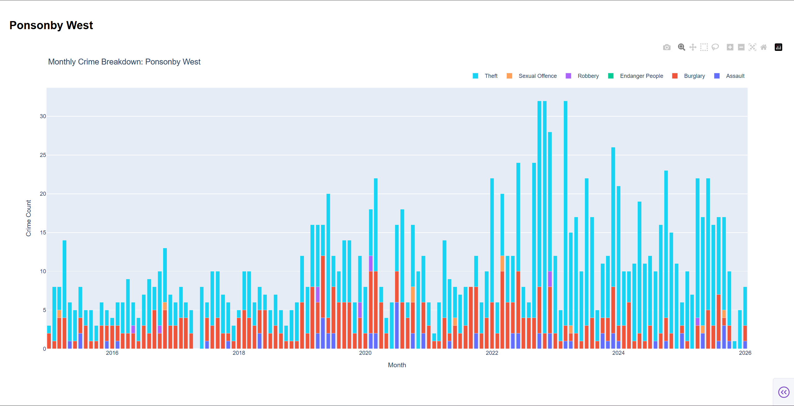

# Auckland house prices

Price assessment models for houses in Auckland, New Zealand


## Install

### Database

Create a [Neon](https://neon.com/) PostgreSQL 17.7 database.

Mock the database schema by `database_schema.sql` file, generated by [`pg_dump`](https://www.enterprisedb.com/download-postgresql-binaries).

>   [!note]
>
>   Any other self-hosted or serverless PostgreSQL database release works, but not tested.
>
>   If using other database, the connection string to Neon database should be replaced by the connection string of your own PostgreSQL database, which looks like `postgresql://<username>:<password>@<domain>/<database_name>?sslmode=require&channel_binding=require`.

### Python environments

This program requires multiple Python virtual environments. There are two options:

-   You can synchronize this scripts in different computers, where each of them uses one environment; OR
-   You can use one computer which satisfies the "computer description" of multiple environments (in the table above), and install those environments in the same computer.

| Environment name                 | Python version | Requirements file path  | Computer description                                         |
| -------------------------------- | -------------- | ----------------------- | ------------------------------------------------------------ |
| Data collection - GitHub Actions | 3.12           | `requirements.txt`      | GitHub Actions runners.                                      |
| Data collection - Self-hosted    | 3.13           | `requirements.txt`      | Any Linux operation system.<br>Open 24-hours every day.<br>Connect to Internet with New Zealand residential IP. |
| Dashboard                        | 3.13           | `requirements-dash.txt` |                                                              |

For each Python environment, let the corresponding requirements file path in the table above be `$req_path`.

Create a Python virtual environment, where the version is mentioned in the table above.

Run the following command in terminal.

```
pip install -r $req_path
```

## Scheduled jobs

### GitHub Actions

Deploy this program in GitHub and enable GitHub Actions for this repository.

Manually run each scheduled job once, to initially save data into database and ensure all the GitHub Actions are active.

Add the following variables into GitHub repository settings "Secrets and variables > Actions > Secrets > Repository secrets".

| Used by           | Variable       | Description                         |
| ----------------- | -------------- | ----------------------------------- |
| (All)             | NEON_DB        | Connection string to Neon database. |
| collect_gaspy.yml | GASPY_EMAIL    | Email of "gaspy" account.           |
| collect_gaspy.yml | GASPY_PASSWORD | Password of "gaspy" account.        |

Add the following variables into GitHub repository settings "Secrets and variables > Actions > Variables > Repository variables".

| Used by           | Variable           | Description                                                  |
| ----------------- | ------------------ | ------------------------------------------------------------ |
| collect_homes.yml | N_THREADS_CHORUS   | Number of threads of parallel data collection from Chorus.   |
| collect_homes.yml | N_THREADS_LAND_TAX | Number of threads of parallel data collection of land tax.   |
| collect_homes.yml | N_THREADS_HOMES    | umber of threads of parallel data collection of houses' details from home.co.nz |


### Self-hosted

These jobs must be self-hosted in New Zealand residential IP address, otherwise jobs will be blocked by their target websites.

Create and activate "Data collection - Self-hosted" Python virtual environment.

Let `$BASE_DIR` and the current directory be the root directory of this program.

>   [!note]
>
>   The system time zone should be NZST or NZDT. Otherwise, the job starting time will be different from described. Run the following command in terminal to confirm.
>
>   ```
>   date
>   ```

Add the following variables into environment variables (lifecycle is the current session).

| Variable     | Description                                                  |
| ------------ | ------------------------------------------------------------ |
| NEON_DB      | Connection string to Neon database.                          |
| TG_BOT_TOKEN | Access token of the new bot, which you created in telegram with `@BotFather`. |
| TG_CHAT_ID   | Create a group and invite the bot. Send any message in the group. Visit `https://api.telegram.org/bot${BOT_TOKEN}/getUpdates`. In the response, find the message like `"from":{"id": ..., "is_bot":false, "first_name": ...,"language_code":"en"},`. This variable is the value in `id` field in this response. |

Run the following commands in terminal to install the self-hosted jobs.

```bash
chmod -R 755 scheduled_jobs/
./scheduled_jobs/install_collect_schools.sh
./scheduled_jobs/install_collect_trademe.sh
```

>   [!important]
>
>   The secret tokens will be written to bash scripts in the folder. Do not re-distribute after installation, unless you intended to copy over the secret tokens.


## Usage

### Fuel prices dashboard

Activate Python environment "Dashboard".

Add the following variables into environment variables.

| Variable | Description                         |
| -------- | ----------------------------------- |
| NEON_DB  | Connection string to Neon database. |

Run the following command in terminal.

```
python crime/dashboard.py
```

Find the URL in terminal output and open in the browser.

Select a fuel type at left-top corner, fuel stations which supply this type of fuel will show on the map. Click any fuel station, the current price and location will show in the card at right-bottom corner.


Click "view historical price" to analyze the price in the past half year (or shorter if data is not available).


### Crime count dashboard

Activate Python environment "Dashboard".

Add the following variables into environment variables.

| Variable | Description                         |
| -------- | ----------------------------------- |
| NEON_DB  | Connection string to Neon database. |

Run the following command in terminal.

```
python fuel/dashboard.py
```

Find the URL in terminal output and open in the browser.

Select the start and end time at left-top corner (by default the past 12 months), number of crime cases (in logarithmic color bar) of each suburb will show on the map. Click any suburb, the name and total crime cases will show in the card at right-bottom corner.



Click "view breakdown" to analyze historical crime count of each month and each category.


