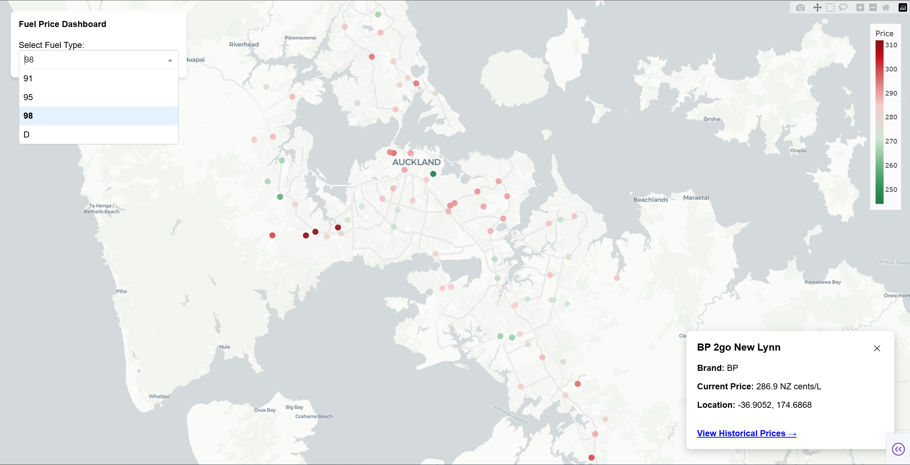
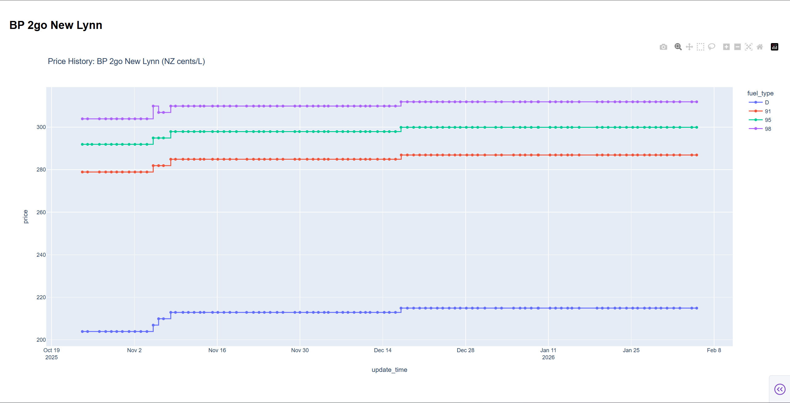

# Fuel prices dashboard


## Usage

Run the following command.

```
python fuel/dashboard.py
```

Find the URL in terminal output and open in the browser.



Select a fuel type at left-top corner, fuel stations which supply this type of fuel will show on the map.

Click any fuel station, the current price and location will show in the card at right-bottom corner.

Click "view historical price" to analyze the price in the past half year (or shorter if data is not available).

