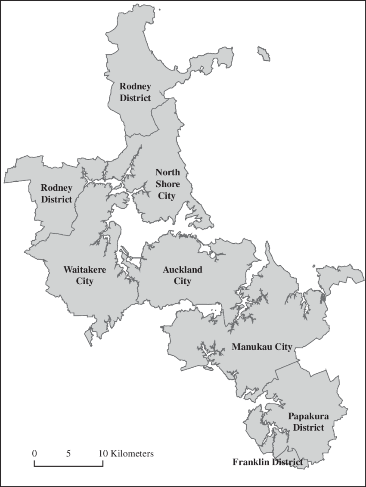

# Get macroeconomics

Data source: https://www.interest.co.nz/charts/


| Metrics                     | Frequency | Script path                            | Output tables                                                |
| --------------------------- | --------- | -------------------------------------- | ------------------------------------------------------------ |
| Consumer price index        | Quarterly | `macroeconomics/cpi.py`                | `public.macroeconomics_cpi_all` & `public.macroeconomics_cpi_non_tradable` |
| Official cash rate          | Weekly    | `macroeconomics/ocr.py`                | `public.macroeconomics_ocr`                                  |
| Auckland house median price | Monthly   | `macroeconomics/house_median_price.py` | `public.macroeconomics_house_median_price`                   |
| Home Loan Affordability     | Monthly   | `macroeconomics/hla.py`                | `public.macroeconomics_hla_low` & `public.macroeconomics_hla_mid` |

Frequency: The update frequency of original index. You don't need to rerun the corresponding script if the original index isn't updated since last run. However, you should run it before running the downstream applications which use this data, if you haven't updated it longer than the update frequency.

Output tables: The job writes data into the output tables in database. (Refer to "Install > Database" article for more details about the database.)

Script path: Location of Python script to collect data.


## Usage

Activate Python environment "Data collection - Self-hosted".

Let the script path in the table above be `$script_path`.

Run the following command in terminal.

```
python $script_path
```


Auckland regions[^1]:

[^1]: Source: https://www.researchgate.net/figure/Auckland-urban-area-overlapping-cities-and-districts_fig1_267696151 


