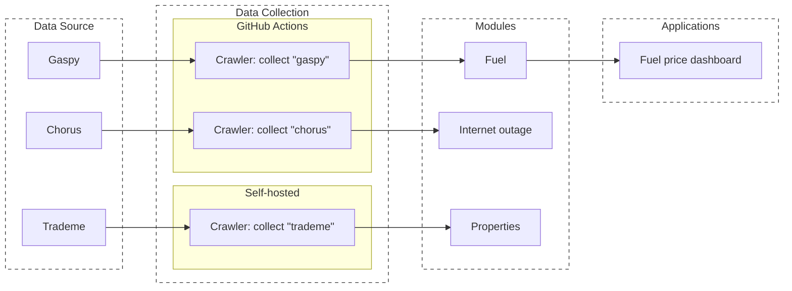

# Overview

This program majorly has 4 parts.

1.   Data source: Internet locations where I collect data which is helpful for house pricing.
2.   Data collection jobs: Automatic jobs which collect data from data source to Neon database.
3.   Modules: Programs which use one or multiple categories of data and generates independent variables that helps predicting house prices.
4.   Applications: Prediction models or visualization dashboards, which uses the data to generate business values.

